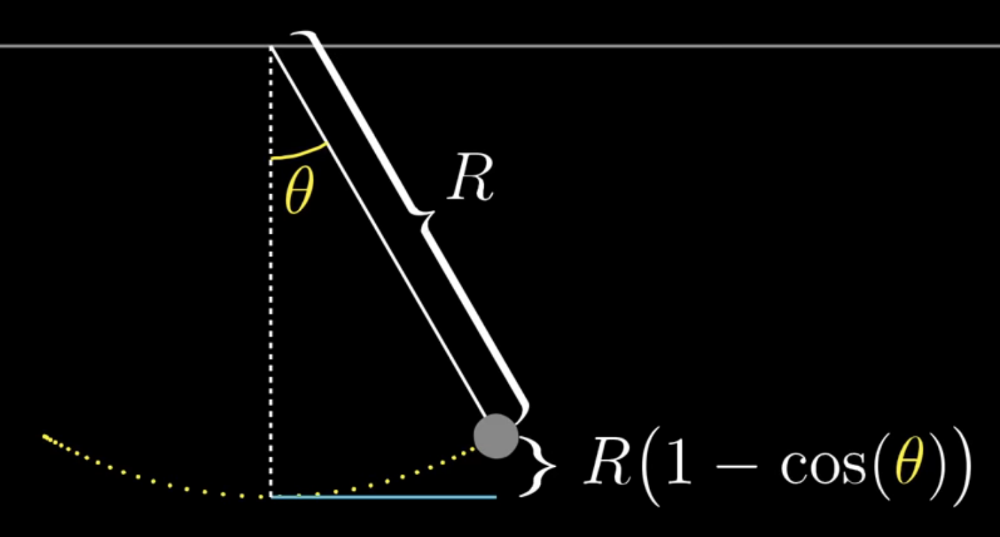
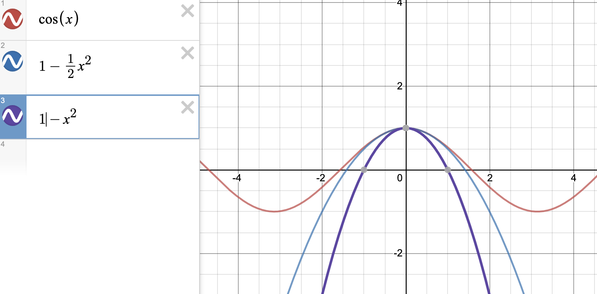
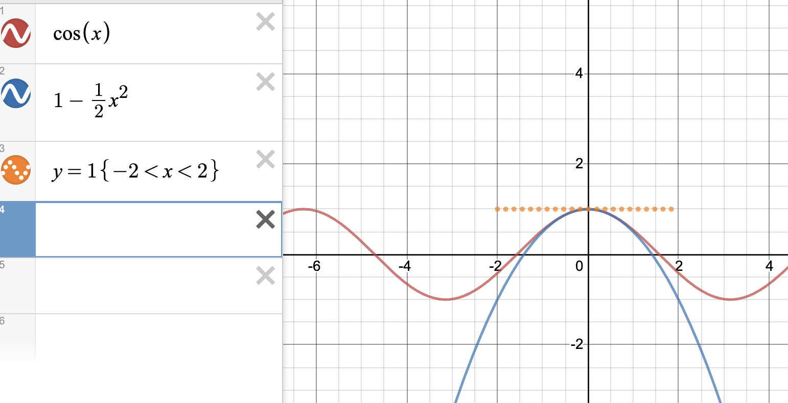
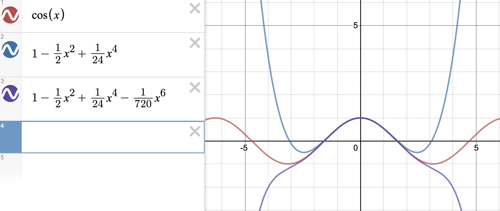

- ref
  - https://www.youtube.com/watch?v=19NrV5oYNGs
  - https://www.youtube.com/watch?v=3d6DsjIBzJ4&list=PLZHQObOWTQDMsr9K-rj53DwVRMYO3t5Yr&index=11

# 테일러 전개 Tailor Expansion
함수가 주어지고 미분을 하다보면 다향식의 형태($c_0+c_1x_1+c_2x_2^2+\dots$)가 매우 편리함을 알 수 있습니다. 삼각함수나 지수함수처럼 차수가 줄지 않는 형태에서는 미분도 까다롭고 그 의미 파악도 힘듧니다. [1Brown3Blue](https://www.youtube.com/watch?v=3d6DsjIBzJ4&list=PLZHQObOWTQDMsr9K-rj53DwVRMYO3t5Yr&index=11)에서는 진자가 움직일 때의 높이 변화를 예로 들고 있습니다.

여기서는 $\theta$에 따라 변하는 높이값이 관심사입니다. 간단한 삼각함수로 진자의 높이는 $R-R \times \cos(\theta)$임을 알 수 있습니다. 그렇다면 $\theta=\frac{\pi}{5.18}$에서 변화량(미분은) 얼마일까요? $R\times \sin(\frac{\pi}{5.18})$입니다. 보자마자 바로 계산 가능하신분? 테일러 전개나 근사가 필요없을수도 있겠네요. 머릿속에서 모델링을 컴퓨터처럼 할 수 있으시니까요. 하지만 저한텐 이런 상황에서 테일러 전개의 강력함이 도움을 줍니다. 함수의 형태가 복잡하고 분석하기 힘들때, $R-R \times \cos(\theta)$를 $x$에 관한 다항식으로 표현하면 다루기 쉬워질테니까요. 문제가 되는 $\cos(\theta)$를 다항식으로 표현해봐야합니다. $\cos(\theta)$의 최대값이 1이므로 비슷한 모양의 $1-x^2$을 그려봅니다. 양 옆으로 조금 더 벌려야겠네요. $1-\frac{1}{2}x^2$의 형태로 그리니 $x=0$ 근처에서는 비슷해 보입니다.

모양을 잘 보면 $x$에서 원래의 함수와 비슷한 그래프를 만들기 위해서는 접선(tangent line)이 만나야 한다는것을 알 수 있습니다. 

기울기가 변하는 지점(변곡점)에서의 접선(미분값)이 결국 그래프의 모양을 결정짓는 주요 값이 될것이라는 예측이 가능하죠. $x=0$에서 원래 그래프 $\cos(x)$를 미분해가며 비슷한 다항식을 찾아보아야 하는데, 일단 $\cos(x)$와 완전히 같아지는 식(항등식)이 있는지 알아보아야합니다.

$$
P(Polynomial:다항식)=c_0+c_1x_1+c_2x_2^2+c_3x_3^3+c_4x_4^4+\dots  
$$
미분을 하기전 $x=0$ 지점에서는 $P(0)$가 1이 됩니다. $c_0$가 1임을 알 수 있죠.
$$
\cos(x)=c_0+c_1x_1+c_2x_2^2+c_3x_3^3+c_4x_4^4+\dots\\
\cos(0)=P(0)=c_0=1
$$
1번 미분을 하면 $c_1$의 값을 알 수 있습니다.
$$
\cos'(x)=-\sin(x)=P'(x)=c_1+2\times c_2x_2+3\times c_3x_3^2+4\times c_4x_4^3+\dots\\
\cos'(0)=-\sin(0)=P'(0)=c_1=0
$$ 
2번 미분도 할 수 있습니다.
$$
\cos''(x)=-\cos(x)=P''(x)=2\times c_2+3\times 2\times c_3x_3+4\times 3\times c_4x_4^2+\dots\\
\cos''(0)=-\cos(0)=P''(0)=2\times c_2=-1
$$ 
3번
$$
\cos'''(x)=\sin(x)=P'''(x)=3\times 2\times c_3+4\times 3\times 2\times c_4x_4+\dots\\
\cos'''(0)=-\sin(0)=P'''(0)=3\times 2\times c_3=0
$$ 
4번!!
$$
\cos''''(x)=\cos(x)=P''''(x)=4\times 3\times 2\times c_4+\dots\\
\cos''''(0)=\cos(0)=P''''(0)=4\times 3\times 2\times c_4=1
$$ 

이런식으로 계속해서 $c$의 값을 구할 수 있습니다. 
$$
P(x) = 1 - \frac{1}{2}x^2+\frac{1}{24}x^4-\frac{1}{720}x^6\dots
$$

이제 $x=0$ 근처에서는 $\cos(x)$ 그래프와 거의 비슷해보입니다. 위 과정에서 보였던 패턴을 $x=a$에서의 식으로 정리해보면 다음과 같습니다
$$
P(x)=P(0)+P'(0)\frac{x^1}{1!}+P''(0)\frac{x^2}{2!}+P'''(0)\frac{x^3}{3!}+\dots\\
=P(a)+P'(a)\frac{(x-a)^1}{1!}+P''(a)\frac{(x-a)^2}{2!}+P'''(a)\frac{(x-a)^3}{3!}+\dots
$$

이 계산을 반복하다보면 언젠가는 $\cos(\theta)$와 거의 같아지는 다항식을 얻을 수 있습니다. 이것이 테일러 전개입니다. 당연한 가정이었지만 테일러 전개를 위해서는 미분이 $n$번 취해지게 되므로,

> "$x=a$에서 테일러 급수가 전개 가능" = "$f(x)$가 $x=a$에서 $n$번 미분 가능"  

은 반드시 만족되어야합니다.

## 테일러 근사식 Tailor Approximation
테일러 전개 자체가 복잡한 식을 단순화 시키기 위해서 근사식을 구하는 과정인데도, 따로 근사식이라는 이름을 붙여놓은 이유는 근사를 어디까지 할건지에 따라 그 간편함이 달라지기 때문일것입니다.

$$
P(x)=
\boxed{
\boxed{
\boxed{
\boxed{
P(a)+P(a)'(x-a)
}^{\ 1차 근사식}
+\frac{P''(a)}{2!}(x-a)^2
}^{\ 2차 근사식}
+\frac{P'''(a)}{3!}(x-a)^3\cdots
}^{\ 3차 근사식}
+\frac{P^{(n)}(a)}{n!}(x-a)^n
}^{\ n차 근사식}
$$

처음 예를 들었던 진자의 운동에서는 $x=0$의 부근에서 관심이 있었기 때문에 1차 근사식까지만 해도 오차가 거의없는 식을 구해 쓸 수 있습니다만, 더 정확도가 필요한 식에서는 차수를 늘려서 사용할 수 있겠죠. 보통 테일러 근사식이라고 하면 1차 근사식을 이야기하는 경우가 많습니다.